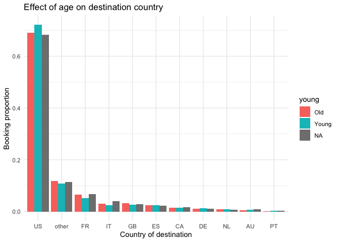
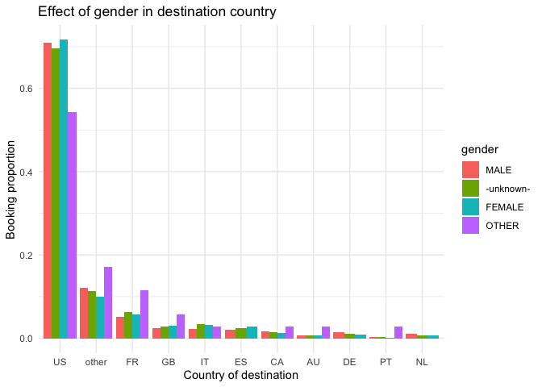
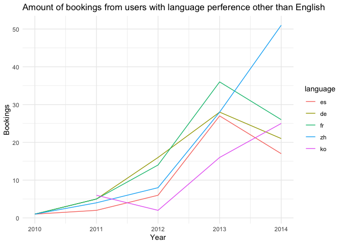
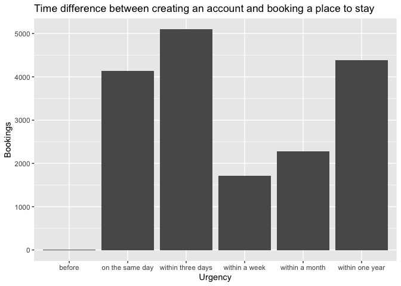

## Finding 1: Age and Gender Preference on Travel Destination

Both old and young users have approximately 50% of booking with a slightly higher proportion for young users ~55%, but this difference has not been tested for significance. Both male and female users have approximately the same percentage of booking and not booking (~50%). Notably, there are a lower proportion of user booking for those with no age or gender information.

Generally, there are a higher proportion of booking in the US as the destination country across gender and age groups. Interestingly, users that have indicated as other genders have a slightly higher percent of booking for destination countries outside of the US than other groups.


```r
# from `initial_EDA.R` I created dataset `young_old` where a new categorical variable
# `young` is made to divide user age group at 45 where <45 ("Young) and =>45 ("Old")
young_old %>%
  # look at users who booked a visit
  filter(book == "Yes") %>%
  # by age group and country
  group_by(young, country_destination) %>%
  # calculate the proportion of bookings
  summarise(count = n()) %>%
  mutate(prop = count/sum(count)) %>%
  # visualize using ggplot2 in a bar chart
  ggplot(aes(x = reorder(country_destination, -prop), y = prop, fill = young)) +
  geom_bar(stat = "identity", position = position_dodge()) +
  labs(title = "Effect of age on destination country", y = "Booking proportion", x = "Country of destination") +
  theme_minimal()
```

<!-- -->


```r
dataset %>%
  # look at users who booked a visit
  filter(book == "Yes") %>%
  # by gender group and country
  group_by(gender, country_destination) %>%
  # calculate the proportion of bookings
  summarise(count = n()) %>%
  mutate(prop = count/sum(count)) %>%
  # visualize using ggplot2 in a bar chart
  ggplot(aes(x = reorder(country_destination, -prop), y = prop, fill = gender)) +
  geom_bar(stat = "identity", position=position_dodge()) +
  labs(title = "Effect of gender in destination country", y = "Booking proportion", x = "Country of destination") +
  theme_minimal()
```

<!-- -->

## Finding 2: Accessibility improvement on languages

Over the course of 2010-2014, users with English preference has been the main target group and has grew significantly along with the total user population. Now with Airbnb's effort in accommodating more language preferences, it has became more accessible to people of other cultures and regions. We can examine their accessibility improvement by analyze the growth of user populations for other language preferences. In 2010, more languages are made available to users among which are French, German, Spanish, Chinese, and Korean. These also turn out to be the top five user language preferences beside English and made up ~99% of the user population other than English users. Users that perfer Chinese and Korean gradually grow over 2010-2014. And users that perfer French, German, and Spanish all shows a growth until a drop in 2012-2013 when more European languages are made available and splited the user groups.


```r
dataset %>%
  # look at users with other language preferences than English
  filter(language != "en") %>%
  # look at those who booked
  filter(book == "Yes") %>%
  # excluded year of 2015 for containing only partial info
  filter(year(date_first_booking) != "2015") %>%
  # group by year and language
  group_by(year(date_first_booking), language) %>%
  summarise(count = n()) %>%
  # select the first five languages made accessible
  filter(language == "fr" | language == "de" | language == "es" | language == "zh" |
           language == "ko") %>%
  rename("language" = "language", "year" = "year(date_first_booking)", "count" = "count") %>%
  # visualize using ggplot2
  ggplot(aes(x = year, y = count, color = language)) +
  geom_line() +
  labs(title = "Amount of bookings from users with language preference other than English", y = "Bookings", x = "Year") +
  theme_minimal()
```

<!-- -->

## Finding 3: Time between creating an account to booking

Now I want to examine the time between users created an account and made a booking. To do so, I create an `urgency()` function that divides the time difference into 7 categories: "before" when users book before creating an account, "on the same day" when users book on the same day as creating an account, "within three days", "within a week", "within a month", "within one year", and "more than one year" after creating an account. From the result below, we can see from users who booked on Airbnb, most users booked on the same day or within three days of first being active and/or creating their accounts, which suggests that most users have plans of traveling before looking for places to stay on Airbnb. Interestingly, there are also a peak of users who booked within a year of creating their accounts. This can also be used to highlight the uniqueness and viscosity of Airbnb as a one of the go-to site for people looking a place to stay when traveling even long after user registration.


```r
urgency <- function(x) {
  cut(x,
    breaks = c(-Inf, -1, 0, 3, 7, 30, 365, Inf),
    labels = c("before", "on the same day", "within three days", "within a week", "within a month", "within one year", "more than one year")
  )
}

create_acc_to_book <- dataset %>%
  filter(!is.na(date_first_booking)) %>%
  mutate(days_to_book = as.double(date_first_booking - date_account_created),
         urgency = urgency(days_to_book))

create_acc_to_book %>%
  group_by(urgency) %>%
  summarise(count = n()) %>%
  ggplot(aes(x = urgency, y = count)) +
  geom_bar(stat = "identity")  +
  labs(title = "Time difference between creating an account and booking a place to stay", y = "Bookings", x = "Urgency")
```

<!-- -->
