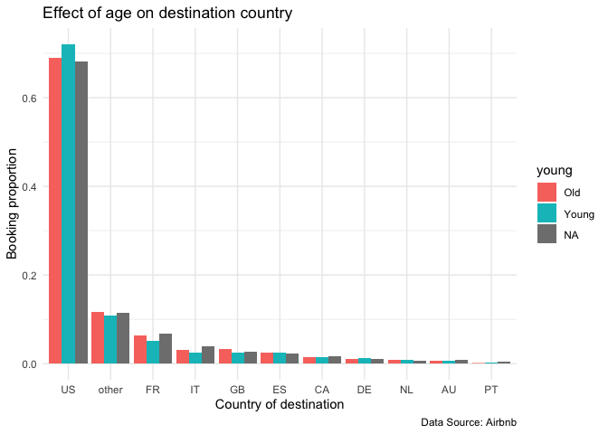
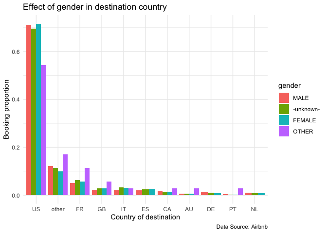
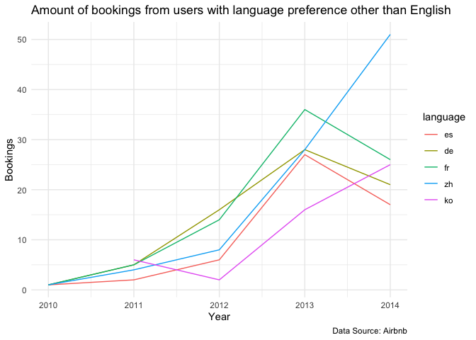
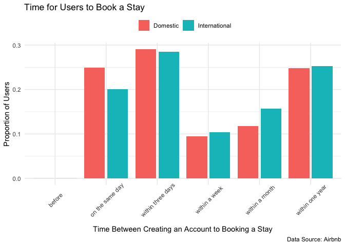

## Finding 1: Age and Gender Preference on Travel Destination

Both old and young users have approximately 50% of booking with a slightly higher proportion for young users ~55%, but this difference has not been tested for significance. Both male and female users have approximately the same percentage of booking and not booking (~50%). Notably, there are a lower proportion of user booking for those with no age or gender information.

Generally, there are a higher proportion of booking in the US as the destination country across gender and age groups. Interestingly, users that have indicated as other genders have a slightly higher percent of booking for destination countries outside of the US than other groups.

<!-- -->

<!-- -->

## Finding 2: Accessibility improvement on languages

Over the course of 2010-2014, users with English preference has been the main target group and has grew significantly along with the total user population. Now with Airbnb's effort in accommodating more language preferences, it has became more accessible to people of other cultures and regions. We can examine their accessibility improvement by analyze the growth of user populations for other language preferences. In 2010, more languages are made available to users among which are French, German, Spanish, Chinese, and Korean. These also turn out to be the top five user language preferences beside English and made up ~99% of the user population other than English users. Users that perfer Chinese and Korean gradually grow over 2010-2014. And users that perfer French, German, and Spanish all shows a growth until a drop in 2012-2013 when more European languages are made available and splited the user groups.

<!-- -->

## Finding 3: Time between creating an account to booking

Now I want to examine the time between users created an account and made a booking. To do so, I create an `urgency()` function that divides the time difference into 7 categories: "before" when users book before creating an account, "on the same day" when users book on the same day as creating an account, "within three days", "within a week", "within a month", "within one year", and "more than one year" after creating an account. From the result below, we can see from users who booked on Airbnb, most users booked on the same day or within three days of first being active and/or creating their accounts, which suggests that most users have plans of traveling before looking for places to stay on Airbnb. Interestingly, there are also a peak of users who booked within a year of creating their accounts. This can also be used to highlight the uniqueness and viscosity of Airbnb as a one of the go-to site for people looking a place to stay when traveling even long after user registration.

<!-- -->
